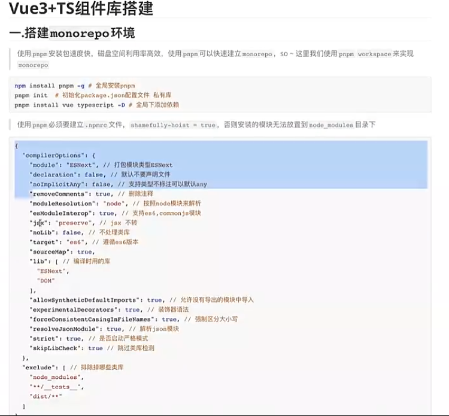

1. pnpm i vue typescript

2. 添加.npmrc文件 ```shamefully-hoist = true```

3. 初始化 ```tsconfig.json``` 文件 ```pnpm tsc --init```



4. 创建 ```pnpm-workspace.yaml``` 告诉monorepo有哪些包

5. 创建packages文件夹，里面有各种包，每个包都是一个仓库，所以每个里面都有```package.json``` 文件

6. 为了让各个包之间能相互调用，回到主项目中来，使用```pnpm add xxx -w``` 将包下载到主项目中来